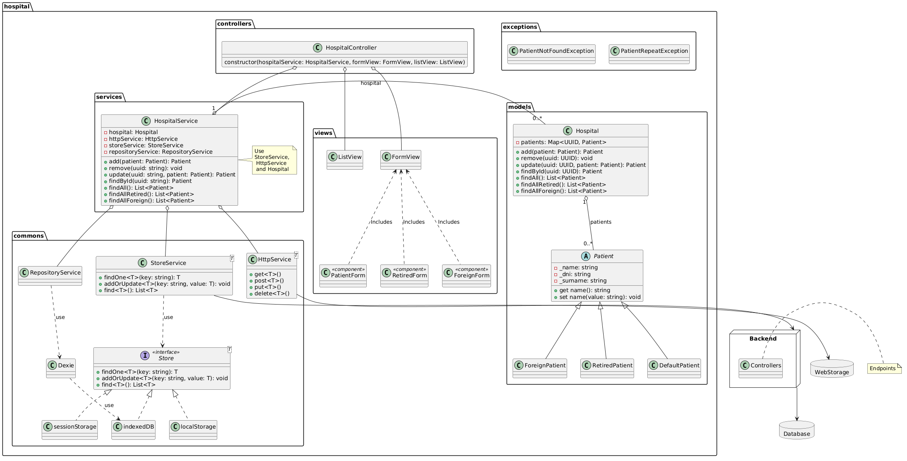

# DWCLE · Plantilla TypeScript + Vite

Esqueleto de proyecto para las prácticas de **Desarrollo Web en Entorno Cliente (DWCLE)**. Con ella escribes
TypeScript que se ejecuta en el navegador y tienes desde el primer día las mismas herramientas que en un equipo
profesional: compilación instantánea, comprobación de tipos, análisis de código, formato automático, tests,
hooks de git y una API falsa para practicar peticiones HTTP.

**Índice**

1. [Qué incluye](#1-qué-incluye)
2. [Requisitos](#2-requisitos)
3. [Cómo obtener la plantilla y crear tu proyecto](#3-cómo-obtener-la-plantilla-y-crear-tu-proyecto)
4. [Primer arranque](#4-primer-arranque)
5. [Estructura del proyecto](#5-estructura-del-proyecto)
6. [Scripts disponibles](#6-scripts-disponibles)
7. [Flujo de trabajo diario](#7-flujo-de-trabajo-diario)
8. [Ficheros de configuración, uno a uno](#8-ficheros-de-configuración-uno-a-uno)
9. [TypeScript en modo estricto](#9-typescript-en-modo-estricto)
10. [Tests con Vitest](#10-tests-con-vitest)
11. [API falsa con json-server](#11-api-falsa-con-json-server)
12. [Commits: formato obligatorio y hooks](#12-commits-formato-obligatorio-y-hooks)
13. [Build y publicación](#13-build-y-publicación)
14. [Diagramas UML](#14-diagramas-uml)
15. [SonarQube (opcional)](#15-sonarqube-opcional)
16. [Problemas frecuentes](#16-problemas-frecuentes)
17. [Enlaces de interés](#17-enlaces-de-interés)

---

## 1. Qué incluye

| Herramienta               | Para qué sirve                                                           | Dónde se configura                        |
| ------------------------- | ------------------------------------------------------------------------ | ----------------------------------------- |
| **Vite 8**                | Servidor de desarrollo con recarga instantánea y build de producción     | `vite.config.ts`                          |
| **TypeScript 5.9**        | JavaScript con tipos; en modo estricto para detectar errores al escribir | `tsconfig.json`                           |
| **ESLint 10**             | Detecta errores y malas prácticas en el código                           | `eslint.config.js`                        |
| **Prettier 3**            | Formatea el código siempre igual, sin discutir estilos                   | `.prettierrc`, `.prettierignore`          |
| **Vitest 5**              | Tests unitarios; incluye un DOM simulado (jsdom)                         | `vite.config.ts`, bloque `test`           |
| **Husky 9 + lint-staged** | Ejecuta ESLint y Prettier automáticamente antes de cada commit           | `.husky/pre-commit`                       |
| **commitlint**            | Obliga a que los mensajes de commit sigan Conventional Commits           | `.husky/commit-msg`, `.commitlintrc.json` |
| **json-server 1**         | API REST falsa a partir de un fichero JSON                               | `src/assets/mocks/db.json`                |
| **GitHub Actions**        | Integración continua: lint, tipos, tests y build en cada push            | `.github/workflows/ci.yml`                |
| **PlantUML**              | Diagramas como texto, con render automático a PNG                        | `doc/uml/`, `.github/workflows/main.yml`  |
| **SonarQube** (opcional)  | Análisis de calidad en local con Docker                                  | `apps/sonarqube/`                         |

## 2. Requisitos

- **Node.js 22.12 o superior.** Recomendado Node 24, que es la versión fijada en `.nvmrc`.
  Comprueba la tuya con `node -v`. Si necesitas instalar o cambiar de versión, la forma más cómoda es
  [nvm](https://github.com/nvm-sh/nvm): `nvm install 24 && nvm use 24`. Con nvm instalado, `nvm use` dentro
  del proyecto lee `.nvmrc` y activa la versión correcta.
- **npm 10 o superior.** Viene con Node.
- **git.** Los hooks de commit dependen de él.
- **Visual Studio Code** con las extensiones recomendadas. Al abrir la carpeta, VS Code te propondrá instalarlas
  (ESLint, Prettier, EditorConfig, Vitest y PlantUML) porque están declaradas en `.vscode/extensions.json`.
- **Docker** solo si quieres regenerar los diagramas en local o usar SonarQube.

## 3. Cómo obtener la plantilla y crear tu proyecto

La plantilla vive en la carpeta `template/` del repositorio de clase `DWCLE-clase`. Tienes tres formas de
conseguirla; en todos los casos acabas con una carpeta nueva que será **tu** proyecto.

**Opción A: copiar desde el repositorio de clase clonado**

```bash
git clone git@github.com:politecnicoDAW-2026/DWCLE-clase.git
cp -r DWCLE-clase/template mi-proyecto
```

**Opción B: descargar el ZIP desde GitHub**

En la página del repositorio, botón **Code > Download ZIP**, descomprime y copia la carpeta `template` con el
nombre que quieras darle a tu proyecto.

**Opción C: con `degit`, que descarga solo esa carpeta**

```bash
npx degit politecnicoDAW-2026/DWCLE-clase/template mi-proyecto
```

Como el repositorio es privado, degit avisa de que no puede descargar el ZIP y recurre a `git clone`: funciona
siempre que tengas acceso al repositorio y git configurado con tu cuenta de GitHub.

Después, sea cual sea la opción:

```bash
cd mi-proyecto
git init                    # tu proyecto pasa a ser un repositorio git propio
npm install                 # instala las dependencias y activa los hooks de commit
git add .
git commit -m "chore: proyecto inicial a partir de la plantilla DWCLE"
```

Para subirlo a GitHub, crea un repositorio vacío en tu cuenta o en la organización y conéctalo:

```bash
git remote add origin git@github.com:TU_USUARIO/mi-proyecto.git
git push -u origin main
```

`node_modules/` y `dist/` están en `.gitignore`: nunca se suben al repositorio. Quien clone tu proyecto ejecuta
`npm install` y obtiene exactamente las mismas versiones gracias a `package-lock.json`, que sí se sube.

## 4. Primer arranque

```bash
npm run dev
```

Se abre el navegador en `http://localhost:5173` con la página de bienvenida. Abre `src/app.ts`, cambia el
texto y guarda: el navegador se actualiza solo. Si el puerto está ocupado, Vite elige el siguiente libre y te
lo indica en la terminal.

Para practicar peticiones HTTP, en una segunda terminal:

```bash
npm run api
```

La API falsa responde en `http://localhost:3000`. Ver la [sección 11](#11-api-falsa-con-json-server).

## 5. Estructura del proyecto

```
mi-proyecto/
├── src/                        TODO tu código va aquí
│   ├── index.html              página de entrada; Vite parte de este fichero
│   ├── app.ts                  punto de entrada: crea los objetos y los conecta con el DOM
│   ├── style.css               estilos globales
│   ├── vite-env.d.ts           tipos de import.meta.env y de los imports de imágenes o CSS
│   ├── assets/
│   │   └── mocks/db.json       datos de la API falsa
│   ├── models/                 entidades del dominio: patient.model.ts, hospital.model.ts…
│   ├── services/               lógica de negocio: hospital.service.ts…
│   ├── views/                  pintan el DOM y leen formularios: list.view.ts, form.view.ts…
│   ├── controllers/            reciben eventos de las vistas y llaman a los servicios
│   ├── commons/                utilidades reutilizables: http.service.ts, store.service.ts…
│   └── exceptions/             errores propios: patient-not-found.exception.ts…
├── public/                     ficheros estáticos que se copian tal cual a dist/ (favicon, imágenes)
├── doc/
│   ├── uml/                    diagramas PlantUML (.puml) y su PNG generado
│   └── auditoria-2026-09.md    registro de la revisión de la plantilla
├── apps/sonarqube/             SonarQube local con Docker (opcional)
├── .github/workflows/          integración continua y render de diagramas
├── .husky/                     hooks de git
├── .vscode/extensions.json     extensiones recomendadas
├── vite.config.ts              configuración de Vite y de Vitest
├── tsconfig.json               configuración de TypeScript
├── eslint.config.js            reglas de ESLint
├── .prettierrc                 reglas de formato
├── .editorconfig               indentación y finales de línea para cualquier editor
├── .nvmrc                      versión de Node del proyecto
├── .commitlintrc.json          formato de los mensajes de commit
├── .gitignore                  qué no se sube nunca a git
└── package.json                scripts y dependencias
```

### La arquitectura que construiremos

Las carpetas de `src/` siguen el patrón **MVC con servicios** que iremos construyendo en clase sobre el ejemplo
del hospital:



- **models**: clases que representan los datos y sus reglas (`Patient`, `Hospital`). No saben nada del DOM ni de
  HTTP.
- **services**: operaciones de negocio (`HospitalService.add`, `findAllRetired`…). Usan los modelos y los
  servicios comunes para persistir o pedir datos.
- **commons**: piezas genéricas reutilizables en cualquier proyecto: `HttpService` para `fetch`,
  `StoreService` para `localStorage`, `sessionStorage` o IndexedDB.
- **views**: lo único que toca el DOM. Reciben datos y los pintan, o leen un formulario y devuelven un objeto.
- **controllers**: conectan vistas y servicios. Escuchan eventos de la vista, llaman al servicio y mandan el
  resultado a la vista.
- **exceptions**: errores con nombre propio (`PatientNotFoundException`) para que el código que los captura
  sepa exactamente qué ha pasado.

Convención de nombres de fichero: `nombre.tipo.ts` en minúsculas y con guiones, por ejemplo
`retired-patient.model.ts` o `hospital.controller.ts`. Los tests van al lado del fichero que prueban con el
sufijo `.spec.ts`.

## 6. Scripts disponibles

| Script                  | Qué hace                                                                     |
| ----------------------- | ---------------------------------------------------------------------------- |
| `npm run dev`           | Servidor de desarrollo con recarga en caliente en el puerto 5173             |
| `npm run api`           | API falsa con json-server en el puerto 3000                                  |
| `npm run build`         | Comprueba tipos y genera la versión de producción en `dist/`                 |
| `npm run preview`       | Sirve `dist/` para probar el build antes de publicarlo                       |
| `npm run typecheck`     | Comprobación de tipos con `tsc`, sin generar ficheros                        |
| `npm run lint`          | Analiza el código con ESLint                                                 |
| `npm run lint:fix`      | Igual, pero corrige lo que se puede corregir automáticamente                 |
| `npm run format`        | Formatea todo el proyecto con Prettier                                       |
| `npm run format:check`  | Solo comprueba el formato, sin tocar nada                                    |
| `npm test`              | Ejecuta los tests una vez                                                    |
| `npm run test:watch`    | Ejecuta los tests cada vez que guardas un fichero                            |
| `npm run test:coverage` | Tests con informe de cobertura en `coverage/`                                |
| `npm run check`         | Lint + formato + tipos + tests. Lo mismo que ejecuta la integración continua |
| `npm run uml`           | Regenera los PNG de `doc/uml/*.puml` con PlantUML en Docker                  |
| `npm run sonar:scan`    | Lanza el análisis de SonarQube, ver `apps/sonarqube/readme.md`               |

`npm run start:dev` y `npm run start:api` siguen funcionando como alias de `dev` y `api`.

## 7. Flujo de trabajo diario

1. Abre dos terminales: `npm run dev` en una y, si lo necesitas, `npm run api` en la otra.
2. Escribe código en `src/`. VS Code te marca los errores de tipos y de lint mientras escribes.
3. Si tocas lógica, escribe o actualiza su test y lánzalo con `npm run test:watch`.
4. Antes de hacer commit, `npm run check`. Si está en verde, la integración continua también lo estará.
5. `git add` y `git commit -m "tipo: descripción"` siguiendo el formato de la [sección 12](#12-commits-formato-obligatorio-y-hooks).
   El hook formatea y revisa tus ficheros; si hay errores, el commit se cancela y te dice por qué.
6. `git push`. En GitHub, la pestaña **Actions** muestra el resultado de la integración continua.

## 8. Ficheros de configuración, uno a uno

**`package.json`.** Nombre del proyecto, scripts y dependencias. Todas las dependencias son `devDependencies`
porque solo hacen falta para desarrollar y construir: el resultado final en `dist/` es HTML, CSS y JavaScript sin
librerías. `"type": "module"` indica que los ficheros `.js` del proyecto usan `import`/`export`. `engines` declara
la versión mínima de Node.

**`tsconfig.json`.** Le dice a TypeScript cómo interpretar el código. Lo importante: `strict: true` activa todas
las comprobaciones; `lib` incluye `DOM` para poder usar `document`, `fetch`, etc.; `types: ["vite/client"]`
añade los tipos de `import.meta.env`; `noEmit: true` porque quien genera JavaScript es Vite, no `tsc`.

**`vite.config.ts`.** `root: 'src'` hace que Vite trabaje desde esa carpeta. El bloque `build` decide dónde y con
qué nombres se genera `dist/`: el JavaScript sale como `bundle.js`, los estilos en `assets/styles/` y las
imágenes en `assets/images/`. El bloque `test` configura Vitest con jsdom. `server.open: true` abre el navegador
al arrancar.

**`eslint.config.js`.** Reglas recomendadas de ESLint y de typescript-eslint, más dos ajustes: prohibido `any`
explícito y las variables sin usar son error salvo que empiecen por `_`. Prettier va el último para que no
choque con las reglas de formato.

**`.prettierrc` y `.prettierignore`.** Comillas simples, punto y coma, líneas de 100 caracteres, coma final.
No se formatean `dist/`, `coverage/`, `package-lock.json` ni los PNG.

**`.editorconfig`.** Indentación de 2 espacios, UTF-8 y finales de línea LF en cualquier editor.

**`.nvmrc`.** Versión de Node del proyecto. `nvm use` la lee.

**`.husky/`.** Dos hooks: `pre-commit` ejecuta `lint-staged`, y `commit-msg` ejecuta `commitlint`. Se activan
al hacer `npm install` porque el script `prepare` llama a `husky`.

**`.commitlintrc.json`.** Extiende la configuración convencional de commitlint.

**`.gitignore`.** Dependencias, builds, cachés, `.env`, logs y ficheros de editor. Nunca lo vacíes.

**`.github/workflows/ci.yml`.** En cada push o pull request instala dependencias y ejecuta lint, formato, tipos,
tests y build. **`main.yml`** regenera los PNG de los diagramas cuando cambia un `.puml`.

## 9. TypeScript en modo estricto

Con `strict: true` TypeScript no deja pasar código ambiguo. Los errores más habituales al empezar y cómo
resolverlos:

| Error                                               | Causa                                                     | Solución                                                                  |
| --------------------------------------------------- | --------------------------------------------------------- | ------------------------------------------------------------------------- |
| `Parameter 'x' implicitly has an 'any' type`        | Un parámetro sin tipo                                     | Escribe el tipo: `function f(x: number)`                                  |
| `Object is possibly 'null'`                         | `querySelector` puede no encontrar el elemento            | Comprueba antes: `if (!el) throw new Error(...)` o usa `el?.`             |
| `'x' is declared but its value is never read`       | Variable o import sin usar                                | Bórrala, o si es un parámetro obligatorio llámala `_x`                    |
| `Property 'value' does not exist on type 'Element'` | `querySelector` devuelve `Element`, no `HTMLInputElement` | Indica el tipo: `document.querySelector<HTMLInputElement>('#dni')`        |
| `Unexpected any. Specify a different type`          | Has escrito `any`                                         | Define una interfaz o un tipo; si de verdad es desconocido, usa `unknown` |

Regla práctica: si tienes que pelearte con el tipo, casi siempre es porque falta una interfaz que describa el dato.

## 10. Tests con Vitest

Los tests viven junto al código con extensión `.spec.ts`. El ejemplo incluido:

```ts
// src/commons/greeting.spec.ts
import { describe, expect, it } from 'vitest';
import { greet } from './greeting';

describe('greet', () => {
  it('saluda por el nombre', () => {
    expect(greet('Carlos')).toBe('Hola, Carlos');
  });
});
```

- `describe` agrupa, `it` es un caso y `expect(...).toBe(...)` es la comprobación.
- Los tests se ejecutan en jsdom, un DOM simulado, así que puedes probar vistas que creen elementos con
  `document.createElement`.
- Prueba la lógica de modelos y servicios, que no dependen del navegador: ahí es donde los tests dan más valor.
- `npm run test:coverage` genera un informe en `coverage/index.html` con las líneas cubiertas.

## 11. API falsa con json-server

`npm run api` sirve `src/assets/mocks/db.json` como API REST en `http://localhost:3000`. Cada clave del JSON es un
recurso y cada elemento necesita un campo `id`:

```
GET    /patients          lista completa
GET    /patients/1        un elemento
POST   /patients          crea (body JSON; el id lo asigna el servidor)
PUT    /patients/1        sustituye
PATCH  /patients/1        modifica campos
DELETE /patients/1        borra
GET    /retired?fullRetired=true    filtro por campo
```

Los cambios se guardan en el propio `db.json`. Si lo rompes, recupéralo con `git checkout src/assets/mocks/db.json`.

Ejemplo de consumo con tipos:

```ts
interface Patient {
  id: number;
  dni: string;
  name: string;
  birthAt: string; // ISO 8601: "1972-01-01"
}

const response = await fetch('http://localhost:3000/patients');
const patients: Patient[] = await response.json();
```

Las fechas están en formato ISO 8601 para que `new Date(patient.birthAt)` funcione sin conversiones.

## 12. Commits: formato obligatorio y hooks

Cada commit pasa por dos comprobaciones automáticas:

1. **pre-commit**: `lint-staged` pasa ESLint y Prettier solo por los ficheros que vas a subir. Si ESLint
   encuentra un error que no puede corregir, el commit se cancela. Prettier reformatea y añade el resultado al
   commit.
2. **commit-msg**: `commitlint` comprueba el mensaje. Formato: `tipo: descripción en minúscula y sin punto final`.

Tipos que usaremos:

| Tipo       | Cuándo                                               | Ejemplo                                   |
| ---------- | ---------------------------------------------------- | ----------------------------------------- |
| `feat`     | Nueva funcionalidad                                  | `feat: añadir formulario de pacientes`    |
| `fix`      | Corrección de un error                               | `fix: corregir cálculo de la edad`        |
| `refactor` | Cambio interno sin alterar el comportamiento         | `refactor: extraer HttpService`           |
| `test`     | Añadir o cambiar tests                               | `test: cubrir HospitalService.add`        |
| `docs`     | Documentación                                        | `docs: explicar el arranque en el README` |
| `style`    | Formato, sin cambios de lógica                       | `style: aplicar prettier`                 |
| `chore`    | Tareas de mantenimiento, dependencias, configuración | `chore: actualizar vite`                  |

Se puede añadir un ámbito entre paréntesis: `feat(views): pintar la lista de pacientes`.

Si un commit falla, lee el mensaje: dice qué fichero y qué regla. Corrige y repite el commit. Saltarse los hooks
con `--no-verify` no está permitido en las prácticas: la integración continua fallaría igualmente.

## 13. Build y publicación

```bash
npm run build      # comprueba tipos y genera dist/
npm run preview    # sirve dist/ en http://localhost:4173 para comprobarlo
```

`dist/` contiene `index.html`, `bundle.js` y `assets/`: ficheros estáticos que se pueden publicar en cualquier
servidor web o en GitHub Pages, Netlify o Vercel. No subas `dist/` a git; se genera en cada despliegue.

## 14. Diagramas UML

Los diagramas se escriben en texto con PlantUML en `doc/uml/*.puml`. Tres formas de verlos:

- **VS Code**: la extensión PlantUML recomendada muestra la vista previa con `Alt+D`.
- **Local**: `npm run uml` regenera los PNG usando Docker.
- **GitHub**: al hacer push de un `.puml`, el flujo _Dibujar diagramas UML_ genera el PNG y lo sube al repositorio.

## 15. SonarQube (opcional)

`apps/sonarqube/` levanta un SonarQube local con Docker para ver bugs, code smells, duplicados y cobertura de tu
proyecto. Instrucciones en [`apps/sonarqube/readme.md`](apps/sonarqube/readme.md).

## 16. Problemas frecuentes

**`npm install` avisa de que la versión de Node no es compatible.** Necesitas Node 22.12 o superior. Instala
Node 24 con nvm y ejecuta `nvm use` en la carpeta del proyecto.

**Los commits no pasan por los hooks.** Los hooks se instalan al hacer `npm install` cuando la carpeta del
proyecto es la raíz del repositorio git. Si hiciste `npm install` antes de `git init`, ejecuta `npx husky` una vez.

**`husky: no hay .git en esta carpeta`.** Es un aviso, no un error: aparece cuando instalas dependencias en una
copia de la plantilla que aún no es un repositorio. Haz `git init` y luego `npx husky`.

**El puerto 5173 o 3000 está ocupado.** Vite cambia de puerto solo y lo indica. Para json-server usa
`npx json-server src/assets/mocks/db.json --port 3001`.

**`import.meta.env` no existe según TypeScript.** Falta `src/vite-env.d.ts` o `types: ["vite/client"]` en
`tsconfig.json`.

**`Object is possibly 'null'` al usar `querySelector`.** Es TypeScript protegiéndote: comprueba que el elemento
existe antes de usarlo. Ver la [sección 9](#9-typescript-en-modo-estricto).

**Prettier y ESLint discuten por el formato.** No debería pasar: `eslint-config-prettier` desactiva las reglas
de formato de ESLint. Si ocurre, ejecuta `npm run format` y después `npm run lint`.

**He borrado `db.json` o está corrupto.** `git checkout src/assets/mocks/db.json` recupera la versión del
último commit.

**Quiero empezar de cero.** Borra `node_modules/` y `dist/` y ejecuta `npm install` de nuevo. El
`package-lock.json` garantiza que instalas las mismas versiones.

## 17. Enlaces de interés

- [Making Wrong Code Look Wrong](https://www.joelonsoftware.com/2005/05/11/making-wrong-code-look-wrong/)
- [TypeScript Handbook](https://www.typescriptlang.org/docs/handbook/intro.html)
- [TypeScript Deep Dive](https://basarat.gitbook.io/typescript)
- [Exploring JS](https://exploringjs.com/)
- [Mostly Adequate Guide to Functional Programming](https://mostly-adequate.gitbooks.io/mostly-adequate-guide/)
- [Awesome JavaScript Learning](https://github.com/micromata/awesome-javascript-learning)
- [Guía de Vite](https://vite.dev/guide/)
- [Vitest](https://vitest.dev/)
- [Conventional Commits](https://www.conventionalcommits.org/es/)
- [json-server](https://github.com/typicode/json-server)
- [PlantUML](https://plantuml.com/es/class-diagram)
